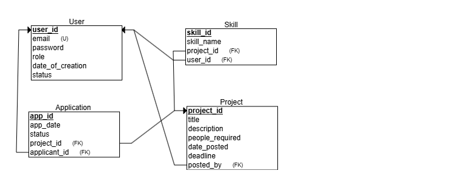

# 🚀 Collaborative Project Management Portal

## 👥 Group Name & Members
**Group Name:** IA637 DataDev Team  

| Name              | Role       |
| ----------------- |------------------ |
| Rakshith Srinath  | Backend Developer   |
| Vardhan           | Frontend Developer  |

---

## 📖 Project Narrative
This **Flask**-based web application provides a multi-role portal for managing academic projects:

- **Admins** can approve/reject users, view system metrics, and manage all data.  
- **Professors** can post new projects with required skills, edit or delete them, and review student applications.  
- **Students** can register, upload resumes, manage personal skills, browse available projects, and submit applications.

Built with:
- **Flask** for routing and templating  
- **MySQL** (via Python DB-API) for relational persistence  
- **Flask-Session** for secure, server-side sessions  
- **Werkzeug**’s `secure_filename` for safe file uploads  
- **Jinja2** + **HTML/CSS** for dynamic UI  

---

## 🔐 Test Users & Credentials

| Role        | Email                     | Password       |
| ----------- | ------------------------- | -------------- |
| **Admin**     | admin@test.com          | 123            |
| **Professor** | test4@test.com          | 12345          |
| **Student**   | test3@test.com          | 12345          |

---

## 🗺️ Relational Diagram



---

## 📊 Analytical Queries

Use these sample SQL queries to demonstrate reporting capabilities:

```sql
-- 1. Count of projects per professor
SELECT u.user_name, COUNT(*) AS projects_count
FROM RV_Project p
JOIN RV_User u ON p.posted_by = u.user_id
GROUP BY u.user_name
ORDER BY projects_count DESC;

-- 2. Top 10 most popular skills
SELECT skill_name, COUNT(*) AS occurrences
FROM RV_Skill
GROUP BY skill_name
ORDER BY occurrences DESC
LIMIT 10;

-- 3. Application status breakdown
SELECT status, COUNT(*) AS count
FROM RV_Application
GROUP BY status;

-- 4. Students with no submitted applications
SELECT u.user_name
FROM RV_User u
LEFT JOIN RV_Application a ON u.user_id = a.applicant_id
WHERE u.role = 'student' AND a.app_id IS NULL;
